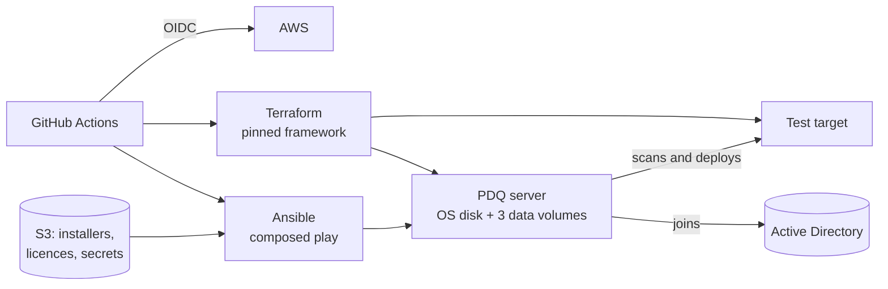

# pdq-deploy-inventory

This repository automates the full Windows host and **PDQ Deploy and Inventory Central Server**
configuration lifecycle in an ephemeral AWS environment. Terraform separates the replaceable
Windows OS disk from three encrypted data volumes that persist across OS replacement. Ansible joins
the host to the directory, installs and licences both products, runs their services under one
local account, places their databases, publishes the Deploy repository, declares the domain
credentials each product authenticates to targets with, points Inventory's computer sync at the
directory's containers, and converges preferences, packages, registration, and console users.
GitHub Actions provisions the host and a test target beside it, can replace the host while
reattaching the same data volumes, reconverges the applications, proves the bounded idempotency
result, and destroys the environment.

At execution time the two application roles overlay onto a version-pinned
[`ansible-framework`](https://github.com/nwarila-platform/ansible-framework) checkout, whose
`windows_disk_manager` provisions the disks.

This is the production automation for **Trinity Technical Services**, the author's company. The
directory, accounts and hostnames it names are that company's own.

## What it demonstrates

- **A destroy-by-default lifecycle that proves itself.** Every run provisions, converges, converges
  again and must report only the changes it expects, then destroys — see
  [`aws-deploy.yml`](.github/workflows/aws-deploy.yml).
- **Data that outlives the OS.** The OS disk is replaceable; three data volumes detach and reattach,
  and PDQ resumes on its existing databases.
- **No stored cloud keys.** GitHub OIDC only, gated to protected `main`, with a separate tag-scoped
  cleanup identity in [`aws-reaper.yml`](.github/workflows/aws-reaper.yml).
- **A pinned supply chain.** Actions and frameworks are pinned by commit; each installer is checked
  against its SHA-256 on the guest immediately before it runs.
- **Verification against the machine, not exit codes.** Each role ends by asserting the state it
  claims, and the scripts re-read the product and fail on a write it silently dropped.
- **Windows automation tested on Linux.** The Pester specs under [`scripts/`](scripts/) stand in for
  the PDQ command line, so the whole read-compare-write-verify path runs in CI with no PDQ
  installed.

## Domain integration

Both hosts join the directory: the PDQ server is filed under `OU=PDQ,OU=Domain Servers` and the
test target under `OU=Domain Workstations`, each publishing its VPC address as its name. The
products' background services stay under one **local** account (`.\svc-pdq`); what reaches a
target is a **domain** account, declared to each product as a credential.

The accounts are created once, by the separate elevated `pdq_ad_config` role against a domain
controller: a read-only directory account (`svc-pdq`) that Inventory's computer sync binds as and
that either product falls back to, plus one account per machine class (`svc-pdq-ws`, `-ms`, `-dc`).
Each class account is added to its targets' local Administrators by that OU's own policy — not by
anything here — so a scan or a deployment reaches a workstation, a member server or a domain
controller as an account that machine admits and no other. Inventory holds all four; Deploy holds
the directory account alone and takes a target's credential from Inventory at deployment time.

Every account is written the same way, where the product that uses it is configured: the account,
the password that opens it, and — for exactly one per store — `is_default`. A bind anywhere in the
directory sync is a *name* into that list, never a password. Nothing under `ansible/applications/`
names this directory, these accounts, or this cloud account; every such fact lives in the playbook
or `ansible/inventory/group_vars/`, stated once.

## What it deploys

| Drive | Label | Purpose |
|---|---|---|
| D: | `PDQINVENTORY` | PDQ Inventory database |
| E: | `PDQDEPLOY` | PDQ Deploy database |
| F: | `PDQREPO` | PDQ Deploy package repository and application share |

Both products run co-located in **Central Server** mode under one shared Background Service User
(`svc-pdq`). Client consoles connect to PDQ Inventory on TCP **7337** and to PDQ Deploy on TCP
**6336**. The controller fetches each product's installer, licence, and the service-account password
from S3 without giving the guest cloud credentials. Installer and licence content is verified
against pinned SHA-256 values; the password is held in memory, rejected if empty, and represented in
the repository only by its object location.

## How it runs

The `aws-deploy` workflow owns the lifecycle: terraform provisions the Windows host, the composed
`pdq-aws.yml` play installs and configures both products, an **idempotency gate** proves the second
converge reports only the two expected service-credential reassertions, and terraform destroys the
host. A push to `main` proves it immediately;
`workflow_dispatch` adds `hold_minutes` (keep the converged host up for interactive work) and
`os_swap` (below).

Locally, `scripts/compose-and-run.sh` builds the same composed tree and runs the play against a
chosen inventory (`COMPOSE_INVENTORY=ansible/inventory/aws_ec2.yml`), given live AWS credentials.

## OS-drive replacement

The data volumes (D:, E:, F:) are standalone and independent of the OS disk. Bumping the framework's
`refresh_serial` — or dispatching `aws-deploy` with `os_swap=true` — **replaces the OS instance in
place while the same data volumes detach and re-attach**, and PDQ resumes on its existing databases
and repository. The disk role adopts an already-labelled volume without reformatting and re-asserts
its drive letter; the roles reinstall the applications and reapply their machine-local
configuration and credentials. The opt-in workflow then runs the same bounded idempotency gate on
the rebuilt host with the data preserved.

## Layout

| Path | Purpose |
|---|---|
| `ansible/applications/pdq_inventory/` | PDQ Inventory application role: credentials, directory sync, collections |
| `ansible/applications/pdq_deploy/` | PDQ Deploy application role and repository/share owner |
| `ansible/applications/pdq_ad_config/` | Elevated role run by hand against a domain controller: the PDQ OU and service accounts |
| `ansible/playbooks/pdq-aws.yml` | Composed play: inventory contract, host readiness, disks, domain join, then both products |
| `ansible/playbooks/ad-config.yml` | The directory objects PDQ depends on, declared once and run by an operator |
| `ansible/inventory/aws_ec2.yml` | Dynamic AWS inventory (filters this run's instances by tag) |
| `ansible/inventory/directory.yml` | The domain controller `ad-config.yml` runs against |
| `ansible/inventory/group_vars/all.yml` | What every play must agree on: the directory's base DN |
| `terraform/aws.tfvars` | Data-only input to the pinned aws-terraform-framework (no `.tf` files here) |
| `scripts/` | Composition, script materialization, and the products' PowerShell utilities |
| `docs/ansible-style-guide.md` | Ansible design and authoring rules |
| `docs/TECH-DEBT.md` | Current engineering debt |

`windows_disk_manager` and all terraform resources are supplied by the pinned frameworks; this
repository declares neither.

## Status

Both application roles are built, independently reviewed, and proven on ephemeral AWS: a full
converge (domain join, install, licence, Central Server mode, ports, firewall, database on its
dedicated drive, credentials, directory sync, preferences, packages, console users, registration)
followed by a green idempotency gate, then OS-drive replacement with the same data
volumes reattached and the products resuming on their existing databases. The AWS pipeline is live
end to end — provision, converge, prove, destroy. Pinned product version: 20.1.8.0.

Proven on a live bed against one directory. Syncing from more than one directory is supported by
the declaration and the script and is proven against a stub only, exactly as the LDAPS bind is,
because no bed has had a second directory to prove it against.

Importing the pinned **variables** and Inventory's **collections** is implemented and was proven
deterministic in CI, but is held out of the converge for now: it drives the product's command line
once per object, at 7–18 seconds a launch, and cost 30.8 minutes of a single deploy. The import and
its prune are held together, because a prune without its import would empty the product. See
TD-007 in [`docs/TECH-DEBT.md`](docs/TECH-DEBT.md).
